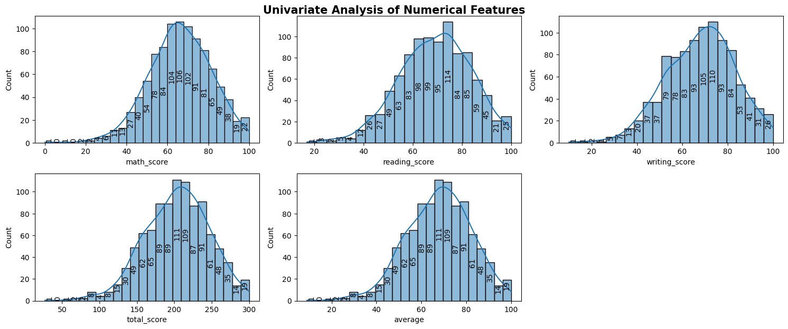
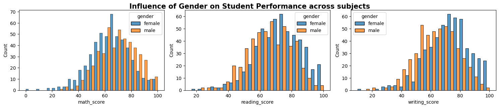
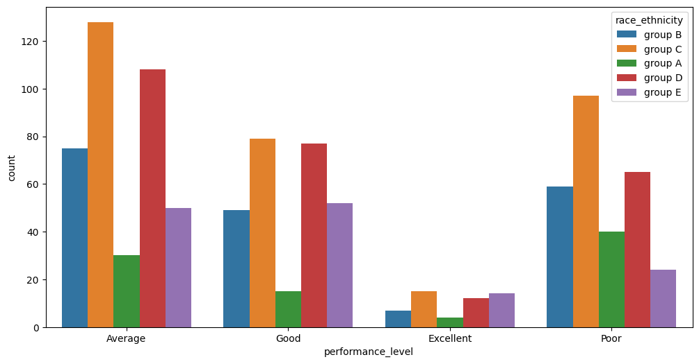

# 🎓 Student Math Score Prediction using Regression

This project is built to predict students' math scores based on various socio-economic and academic factors using the best selected  machine learning regression model. The dataset used is StudentsPerformance.csv and includes features such as gender, race_ethnicity, parental level of education, lunch type, and test preparation course status, reading score, writing score and math score of students.

## ✅ Features

1. Data ingestion, transformation, and model training modularized in src/components .

2. Exploratory data analysis using Python libraries - matplotlib, numpy, pandas and seaborn in Jupyter notebook.
    Sample Visualizations:-
    
    
    

3. Trained regression model and preprocessor, stored as model.pkl and preprocessor.pkl, with training and testing data in artifacts/ respectively.

4. Flask-based web interface to input student details and predict math score.
    

5. Exception handling and logging integrated

Used libraries like scikit-learn, pandas, numpy, seaborn, matplotlib, Flask, etc.

## 🚀 How to Run the Project

1. Clone the Repository:- 

>> git clone https://github.com/Adityajain8595/Student-Math-Score-Prediction.git

>> cd student-score-predictor

2. Install Dependencies:-

>> pip install -r requirements.txt

3. Perform data ingestion, data transformation and model training:-

>> python data_ingestion.py

3. Run the Flask App

>> python app.py

Then, go to http://127.0.0.1:5000/predictdata in your browser.

## 🧪 Model Information

Algorithm Used: Ridge Regression, the best model selected from other regression models of 

1. Decision Tree Regression,
2. K-Nearest Neighbours Regression,
3. Random Forest Regression,
4. Linear Regression,
5. Ridge,
6. Lasso,
7. ElasticNet,
7. Support Vector Regression, 
8. Adaboost Regression,
9. Gradient Boosting Regression,
10. XgBoost Regression,
11. CatBoost Regression

Evaluation Metric: R² Score, RMSE, MAE, MSE
Preprocessing: One-hot encoding, Standardization, etc.

## 📊 Dataset

The dataset is included in notebook/data/StudentsPerformance.csv, containing information such as:

## 🛠️ Author and Contributions

Developed by Aditya Jain as part of a model deployment project.